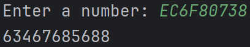
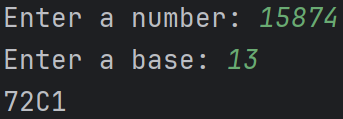
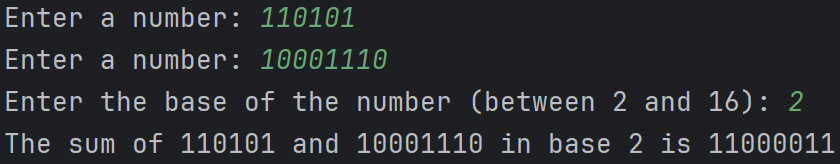
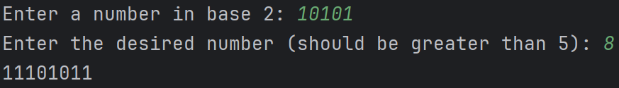

#  I2DS_assignment-1

## *assignment:*
https://moodlearn.ariel.ac.il/pluginfile.php/3646543/mod_assign/introattachment/0/%D7%9E%D7%98%D7%9C%D7%94%201.pdf?forcedownload=1

***Question 1:***
Write Python code that takes a number as a string and the base of the number, and prints the decimal value of the number.

***Question 2:***
Write Python code that receives a decimal number and a desired base, and prints the number after converting it to the requested base. The value returned by the code should be of type string.

***Question 3:***
Write Python code that receives two numbers in a given base and the base of those numbers, and prints the sum of the two numbers.

***Question 4:***
Write Python code that receives a binary number and a desired number of digits in the result, and returns the number representing its negative.

## *Functions and their descriptions*

- strtolist - Turn a string into a list of its characters.
- listtostr - Combine a list of characters into a single string.
- swap - Reverse the elements of a list.
- strtoint - Convert a string of digits into an integer.
- n_to_10 - Convert a number from any base to base 10.
- n_10_to_base - Convert a base-10 number to any other base.
- add_in_base - Add two numbers in a given base.
- return_negative - Calculate the two's complement representation of a binary number.

## *Examples for the questians:*

***Question 1:***

***Question 2:***

***Question 3:***

***Question 4:***

